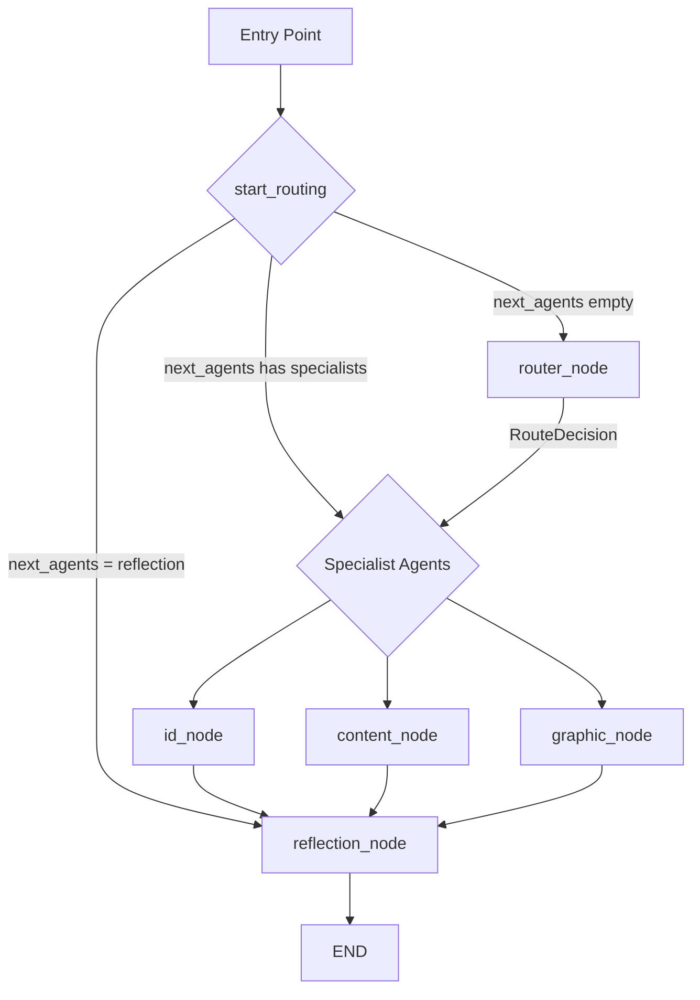

# MASTER CODEX: Cong Xuong Agent QC

## Tong quan
Day la he thong multi-agent de QC hoc lieu e-learning va graphic assets. Runtime hien tai gom cac agent:
- `Router-Agent`: route yeu cau chung.
- `ID-Agent`: review Articulate/Rise/Storyline, interaction, quiz logic, navigation, accessibility, on-screen text.
- `Content-Agent`: review text/storyboard, grammar, spelling, British English, terminology consistency.
- `Graphic-Agent`: review Figma links, screenshots, layout, spacing, hierarchy, readability, WCAG visual issues.
- `Reflection-Agent`: rut kinh nghiem tu findings va feedback de cap nhat knowledge.

Tat ca QC report do he thong sinh ra phai o dang song ngu Anh - Viet trong cung mot file `report.md`.

## Cau truc chinh
```text
project_root/
|-- main.py
|-- .env
|-- agents/
|   |-- router.py
|   |-- id_agent.py
|   |-- content_agent.py
|   |-- graphic_agent.py
|   `-- reflection_agent.py
|-- core/
|   |-- config.py
|   |-- content_sources.py
|   |-- graph.py
|   |-- knowledge.py
|   |-- llm.py
|   |-- reporting.py
|   |-- state.py
|   `-- utils.py
|-- tools/
|   `-- text_tools.py
|-- knowledge/
|   |-- general/
|   |   |-- human_feedback_lessons.md
|   |   |-- system_lessons.md
|   |   `-- wcag_global.md
|   `-- requirements/
|       `-- project_x_req.md
|-- outputs/
|   `-- <bundle>/
|       |-- report.md
|       `-- artifacts/
`-- docs/
    |-- master_codex.md
    |-- memory_onboard.md
    `-- communication.md   # optional runtime log, auto-created when needed
```

## Command surface
- `/id`
- `/cg`
- `/fg`
- `/reflect`
- `/cleanup`

## LangGraph runtime
LangGraph runtime hien tai co **5 nodes**:
- `router`
- `id`
- `content`
- `graphic`
- `reflection`

`graphic_node` da duoc noi vao `core/graph.py`. Neu ban thay diagram cu chi co 4 nodes, do la tai lieu cu, khong phai loi runtime.



## Routing rules
Thu tu uu tien:
1. Explicit command trong `main.py`
2. Auto-detect
3. Router LLM

Auto-detect hien tai:
- Articulate / Rise / Storyline / SCORM URLs -> `id`
- local `pdf` / `csv` / `docx` paths -> `content`
- Figma links -> `graphic`, hoac `content` + `graphic` neu request ro la storyboard/copy/content QA
- screenshot / design-review style prompts -> `graphic`

## Source access policy
- `Figma = direct QC supported`
  - `Graphic-Agent` co the QC truc tiep tu Figma link/frame.
  - `Content-Agent` ho tro Figma theo hybrid flow: Codex/Figma plugin resolve frame content truoc, sau do runtime Python nhan source da duoc chuan hoa de QC content.
  - Neu request co kem screenshot, screenshot do phai duoc luu vao cung bundle `outputs/<bundle>/artifacts/`.
  - Figma la nguon live duoc ho tro cho ca storyboard-tren-canvas va graphic review.
- `Google Workspace noi bo = artifact-first`
  - Doi voi Google Docs, Sheets, Slides noi bo cong ty, quy trinh uu tien la export artifact truoc khi QC.
  - Artifact MVP cho `Content-Agent`: `pdf`, `csv`, `docx`.
  - Artifact khac nhu `xlsx`, `png`, `jpg`, hoac slide export co the duoc bo sung sau.
  - Ly do: session runtime hien tai khong nen phu thuoc vao quyen truy cap domain noi bo hoac login Google Workspace.

## Agent scopes
### Router-Agent
- Muc tieu: route yeu cau sang `id`, `content`, `graphic`, hoac nhieu agent cung luc.
- Khong inject knowledge vao router.

### ID-Agent
- Scope: browser-style QA, interaction coverage, quiz logic, navigation, accessibility, grammar/spelling on screen.
- Co the chay heuristic fallback neu LLM/API khong san sang.
- Quality bar for section-level QC:
  - phai click het interactive trong pham vi duoc yeu cau
  - phai doc het text moi lo ra sau moi lan tuong tac
  - phai di het knowledge check xa nhat co the trong section do
  - neu coverage chua day du thi report phai noi ro phan con thieu, khong duoc gia vo da quet xong

### Content-Agent
- Scope: storyboard copy, subtitles, on-screen text, grammar, spelling, British English, terminology alignment.
- Co the doc artifact local `pdf`, `csv`, `docx` va QC tren text da extract.
- Co the review screenshot-based content neu screenshot duoc cung cap va duoc luu vao bundle artifacts.
- Neu Figma frame moi o dang link thuan va chua duoc plugin/Codex resolve thanh content source thi agent phai report ro limitation, khong duoc gia vo da doc duoc frame content.
- Khong con phu trach graphic review.

### Graphic-Agent
- Scope: Figma/screenshot graphic QA.
- Focus:
  - layout and spacing
  - typography and readability
  - contrast and accessibility
  - visual hierarchy
  - component consistency
  - WCAG 2.2 visual risks

### Reflection-Agent
- Manual mode: `/reflect`
- Automatic mode: rut lessons tu findings sau specialist run
- Skip auto-reflection khi findings < 2

## Knowledge
Knowledge duoc inject vao specialist agents theo thu tu:
1. `knowledge/general/human_feedback_lessons.md`
2. `knowledge/general/system_lessons.md`
3. `knowledge/general/wcag_global.md`
4. `knowledge/requirements/project_x_req.md`

WCAG baseline dung chung cho toan he thong la `WCAG 2.2`.

Knowledge hien tai da bao gom cac rule van hanh quan trong cho giai doan MVP:
- report bundle phai duoc tao cho moi QC pass
- neu request co screenshot thi file anh phai duoc luu trong `outputs/<bundle>/artifacts/`
- `Content-Agent` duoc phep ingest `pdf`, `csv`, `docx`
- Figma content QA phai di qua hybrid pre-resolution khi can doc text tren frame

## Model mapping hien tai
Gia tri duoi day la mapping runtime theo code trong `core/config.py`. Gia tri thuc te co the thay doi qua `.env`.

### Router-Agent
- provider env: `ROUTER_PROVIDER`
- model env: `ROUTER_MODEL`
- default code: `groq` + `llama-3.3-70b-versatile`

### ID-Agent
- provider env: `ID_PROVIDER`
- model env: `ID_MODEL`
- default code: `groq` + `llama-3.3-70b-versatile`

### Content-Agent
- provider env: `CONTENT_PROVIDER`
- model env: `CONTENT_MODEL`
- default code: `groq` + `llama-3.3-70b-versatile`

### Graphic-Agent
- provider env: `GRAPHIC_PROVIDER`
- model env: `GRAPHIC_MODEL`
- default code: ke thua tu `DESIGN_REVIEW_PROVIDER` / `DESIGN_REVIEW_MODEL`
- default fallback cu the: `groq` + `llama-3.2-90b-vision-preview`

### Reflection-Agent
- provider env: `REFLECTION_PROVIDER`
- model env: `REFLECTION_MODEL`
- default code: `google` + `gemini-2.5-flash`

## Gemma adoption note
Code hien tai moi co adapter cho 2 provider trong `core/llm.py`:
- `groq`
- `google`

Neu ban dung `Gemma` qua mot endpoint tuong thich voi 2 provider nay, thuong chi can doi `*_MODEL` trong `.env`.

Neu ban muon dung `Gemma` qua mot provider khac, can:
1. them adapter vao `core/llm.py`
2. cap nhat `AppConfig` trong `core/config.py`
3. cap nhat validation va test

## Reporting convention
Moi run tao mot bundle rieng trong `outputs/`:
```text
outputs/<timestamp>_<slug>_<id>/
|-- report.md
`-- artifacts/
```

Reporting rules:
- moi agent QC (`/id`, `/cg`, `/fg`) deu phai tao `report.md`
- `artifacts/` la noi luu tat ca evidence di kem request hoac evidence sinh ra trong qua trinh QC
- neu request co screenshot upload san, file screenshot do phai duoc giu nguyen trong `artifacts/` cung bundle voi report

Report format:
- phan tieng Anh
- `## Ban Dich Tieng Viet`
- phan tieng Viet append o cuoi cung

Artifact minimum for browser-assisted ID QC:
- review shell probe hoac access probe neu public shell gap van de
- section/content probe co text da reveal va state da di qua
- full-page screenshot cua state da test
- ghi ro cac answer path hoac interaction path da duoc verify

Artifact expectation for content / graphic QC:
- screenshot upload tu user -> luu vao `artifacts/`
- file local duoc reference trong request -> uu tien copy hoac preserve chung voi bundle khi hop ly
- neu session khong expose duoc bytes/path cua attachment, report hoac artifact note phai noi ro limitation

## Cleanup
`/cleanup` dung de don dep cache va temp files cua project. Lenh nay khong duoc xoa source code, `.venv`, hoac cac report bundle hop le trong `outputs/`.

Trong Codex chat, co the goi workflow tuong ung bang `$cleanup` de chay cung logic don dep nay.

## Upgit
`/upgit` chay `/cleanup` truoc, sau do stage workspace lien quan, bo qua mac dinh cac file runtime/generated nhu `docs/communication.md` va `outputs/`, tao commit neu co thay doi moi, va push len nhanh git hien tai. Neu khong truyen message, lenh se tu sinh commit message phu hop. Co the truyen commit message ngay sau lenh, vi du: `/upgit chore: add upgit command`.

Trong Codex chat, co the goi workflow tuong ung bang `$upgit`.
